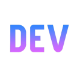

# Hi there, I'm Tigin Tom! 👋

  

🎓 **MCA Graduate from Marian College Kuttikkanam**  
💻 **Full-Stack Developer | Aspiring AI/ML Engineer**  
🚀 **Building projects using React, FastAPI, Python, and modern web technologies**

I enjoy building practical applications and improving my development skills through real-world projects and continuous learning.

## 🎯 Focus & Highlights

- 🧠 Currently focused on **RAG-based systems** and **LLM deployment** with **LLaMA2 / Llama 3**.
- 💡 Experienced in developing backend services with **Django** and **Flask**, and integrating **RESTful APIs**.
- 📈 Built a **Multi-Model ML Prediction Platform** and a **PDF Summarizer & Insight Extractor**.
- 🌐 Open to learning and collaboration opportunities in **AI/ML Engineering** and **Python Development**.

## 📚 Technical Skills

<strong>Expand to see my Tech Stack</strong>

 

### AI/ML & Data

### Backend & Frameworks

### Databases

### Frontend & Languages

### Tools & Platforms

## 📈 GitHub Highlights

- Learning AI/ML engineering and backend system design
- Building full-stack applications with **React** & **FastAPI**
- Improving problem-solving and software development skills
- Focused on creating real-world projects and growing as a developer

## 💻 Tech Stack & Skills

### Languages

### Frontend

### Backend & Database

### Tools

## 🚀 Featured Projects

<strong>Click to view my projects</strong>

 

### [📄 PDF Summarizer & Insight Extractor with Chatbot](https://github.com/Tigin-T-om/PDF-Summarizer-with-LLM)
- Built a **RAG-based system** for querying and summarizing multiple PDFs using **LLaMA2** (Ollama).
- Features: Interactive **Streamlit** UI for chat-based Q&A and AI-driven summarization.
- **Tech Stack**: Python, Streamlit, LLaMA2, FAISS, PyMuPDF.

### [ 💼 Job Tracker AI]()

- AI-powered job tracking platform to manage applications, follow-ups, and interview progress.
- **Technologies:** React, FastAPI, PostgreSQL, Python

### [🎥 Movie Ticket Booking System](https://github.com/Tigin-T-om/Movie_ticket)

- A web application for seamless movie ticket booking.
- **Technologies**: HTML, CSS, js, PHP

### [🧠 Predictfy - Multi-Model ML Prediction Platform](https://github.com/Tigin-T-om/Predictfy)
- An interactive web app integrating 5 ML models (Linear, Polynomial, KNN, Logistic Regressions) for various predictions.
- Designed a single-page UI using **Flask** for accessible deployment and predictions.
- **Tech Stack**: Python (scikit-learn, NumPy, Pandas), Flask, HTML, CSS, JavaScript.

### [🗳️ Campus Vote-Hub - College Online Voting Platform](https://github.com/Tigin-T-om/Campus-Vote-Hub)
- Developed a secure online voting platform with student authentication and role-based access.
- Implemented voting workflows and real-time result computation with a **Django** backend.
- **Tech Stack**: Django, HTML, CSS, JavaScript, MySQL/SQLite.

### [🌐 Personal Portfolio](https://github.com/Tigin-T-om/Portfolio)

- My portfolio website showcasing my skills and projects.
- **Technologies**: HTML, CSS, JavaScript

  
<h2>📊 Stats and Activity</h2>

   

  
<h3>📈 Stats & Contributions</h3>

  

  

    
  

  

    
  

## 📊 GitHub Stats

  
  
  

  

  
<h3>🔥 Streak Stats</h3>

  

  

    
  

  
<h3>🏆 GitHub Trophies</h3>

  

  

    
  

## 🌐 Let's Connect & Code

## 🌐 Connect With Me

  
  
  
  
  
  <a href="https://github.com/Tigin-T-om" target="_blank">
    
  
  

🙌 Thank you for visiting my profile! Let's build something great.

